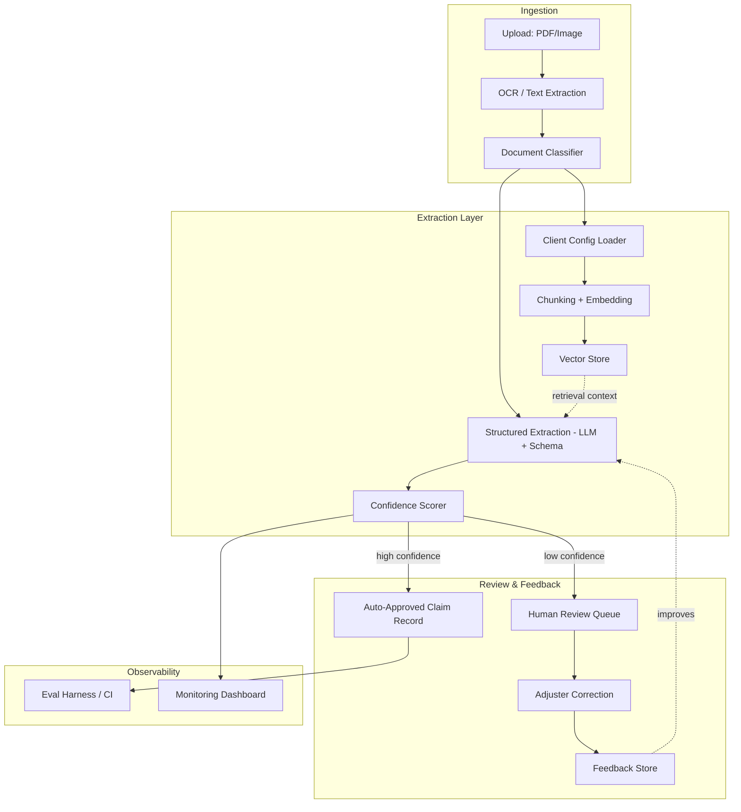

# ClaimSight

Multi-tenant insurance claims document intelligence platform. Ingests messy
claim documents (accident reports, policy PDFs, medical bills), extracts
structured data, scores confidence per field, and routes low-confidence
extractions to human review — with per-client schemas driven by config,
not forked code.

**Status:** Day 1 — project scaffold. API skeleton, core data schema, and
CI are live. Extraction, retrieval, and the review workflow land over the
next 3 weeks; see `PROGRESS.md` for the running log.

## Architecture (target — most pieces not built yet)



## Run it locally

```bash
pip install -r requirements.txt
uvicorn app.main:app --reload
```

Then:
- `GET /health` — liveness check
- `GET /` — service info
- `GET /schema/claim-document` — current `ClaimDocument` JSON schema
- `GET /docs` — interactive API docs (FastAPI auto-generated)

## Run it via Docker

```bash
docker compose up --build
```

## Run tests

```bash
pytest tests/ -v
```

## Project layout

```
claimsight/
├── app/
│   ├── main.py              # FastAPI entrypoint
│   ├── models/schemas.py    # canonical ClaimDocument data contract
│   ├── ingestion/           # OCR + document classification (Week 1)
│   ├── extraction/          # chunking, embeddings, LLM extraction (Week 2)
│   ├── review/               # human review queue + feedback (Week 2)
│   └── config/                # per-tenant config loader (Week 1)
├── configs/                    # per-client YAML configs
├── eval/                        # golden dataset + eval harness (Week 3)
├── tests/
└── .github/workflows/          # CI
```

## Why this exists

Built as a demonstration of forward-deployed / applied-AI engineering:
taking an ambiguous client problem (extract structured data from
inconsistent insurance paperwork) and shipping a system that's
production-shaped from day one — typed data contracts, per-tenant
configuration instead of forked code, confidence-aware automation instead
of blind trust in LLM output, and an evaluation harness that gates changes
in CI rather than "looks fine in the demo."

Full build log in `PROGRESS.md`. Notable bugs and the lessons from them in
`MISTAKES.md`.
