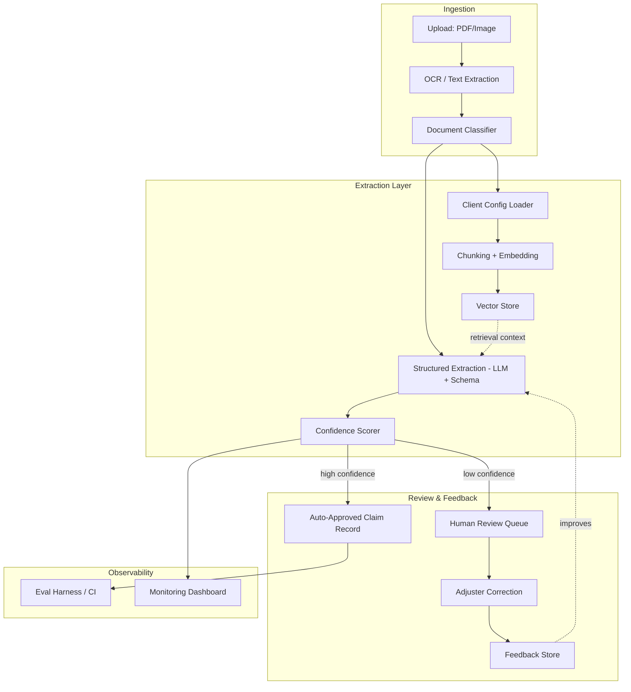

# ClaimSight

Multi-tenant insurance claims document intelligence platform. Ingests messy
claim documents (accident reports, policy PDFs, medical bills), extracts
structured data, scores confidence per field, and routes low-confidence
extractions to human review — with per-client schemas driven by config,
not forked code.

**Status:** Day 5 — golden dataset started (10 of ~30 examples) and
already used the way it's supposed to be: measured classification
accuracy (80%), found a real gap in keyword coverage, fixed it, and
re-measured (100%). Structured field extraction, retrieval, and the
review workflow land over the next weeks; see `PROGRESS.md` for the
running log.

## Architecture (target — most pieces not built yet)



## Run it locally

```bash
pip install -r requirements.txt
python scripts/generate_sample_docs.py   # creates data/sample_docs/
uvicorn app.main:app --reload
```

Then:
- `GET /health` — liveness check
- `GET /` — service info
- `GET /schema/claim-document` — current `ClaimDocument` JSON schema
- `GET /tenants` — list configured tenants
- `GET /tenants/{tenant_id}` — inspect one tenant's config
- `POST /ingest` — upload a PDF/image + a `tenant_id`, get back extracted
  text, extraction method, classified document type, and whether that
  document type is `in_scope_for_tenant` per that tenant's config
- `GET /docs` — interactive API docs (FastAPI auto-generated)

See the actual multi-tenant behavior — same file, different tenant, different result:
```bash
curl -X POST http://localhost:8000/ingest \
  -F "file=@data/sample_docs/medical_bill_sample.pdf" -F "tenant_id=acme_insurance"
# -> in_scope_for_tenant: true (Acme's contract covers medical bills)

curl -X POST http://localhost:8000/ingest \
  -F "file=@data/sample_docs/medical_bill_sample.pdf" -F "tenant_id=beta_insurance"
# -> in_scope_for_tenant: false (Beta's contract doesn't)
```

Try the OCR fallback path specifically:
```bash
curl -X POST http://localhost:8000/ingest \
  -F "file=@data/sample_docs/accident_report_scanned.pdf" -F "tenant_id=acme_insurance"
```

## Run it via Docker

```bash
docker compose up --build
```

## Run tests

```bash
pytest tests/ -v
```

## Run the eval harness

```bash
python scripts/generate_golden_dataset.py   # if not already generated
python eval/run_eval.py
```

Reports classification accuracy against 10 hand-labeled examples
(normal cases, phrasing variants, and one deliberately ambiguous
document that should classify as `unknown`). Grows into a full
extraction-accuracy harness in Week 3.

## Project layout

```
claimsight/
├── app/
│   ├── main.py              # FastAPI entrypoint
│   ├── models/schemas.py    # canonical ClaimDocument data contract
│   ├── ingestion/           # OCR + document classification (Week 1)
│   ├── extraction/          # chunking, embeddings, LLM extraction (Week 2)
│   ├── review/               # human review queue + feedback (Week 2)
│   └── config/                # per-tenant config loader (Week 1)
├── configs/                    # per-client YAML configs
├── eval/                        # golden dataset + eval harness (Week 3)
├── tests/
└── .github/workflows/          # CI
```

## Why this exists

Built as a demonstration of forward-deployed / applied-AI engineering:
taking an ambiguous client problem (extract structured data from
inconsistent insurance paperwork) and shipping a system that's
production-shaped from day one — typed data contracts, per-tenant
configuration instead of forked code, confidence-aware automation instead
of blind trust in LLM output, and an evaluation harness that gates changes
in CI rather than "looks fine in the demo."

Full build log in `PROGRESS.md`. Notable bugs and the lessons from them in
`MISTAKES.md`.
